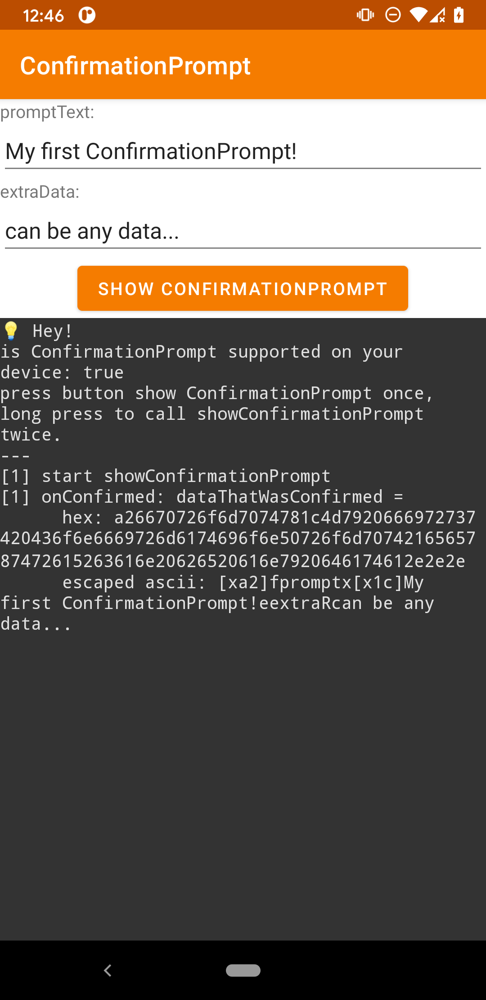
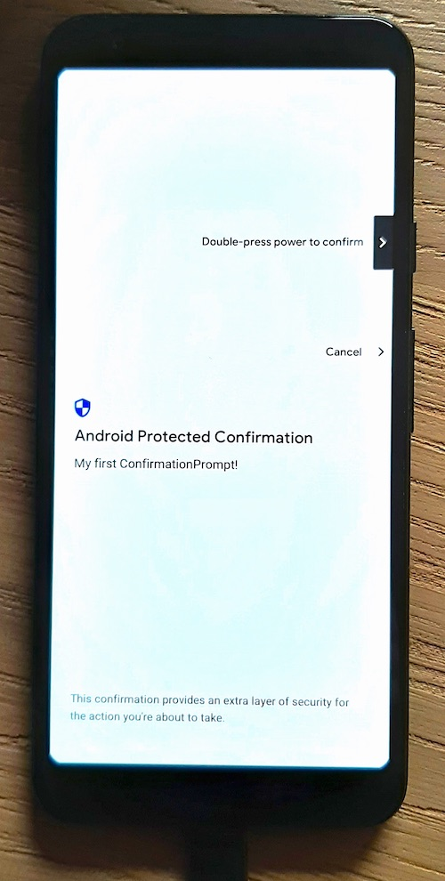

# ConfirmationPrompt Playground

A simple Android App that shows a customizable [Android Protected Confirmation](https://developer.android.com/training/articles/security-android-protected-confirmation).

This is a supplementary project that contains the source-code mentioned in the blog post [http://xa1.at/android-protected-confirmation-behavior](http://xa1.at/android-protected-confirmation-behavior).

**MainActivity:**

**Android Protected Confirmation:**

